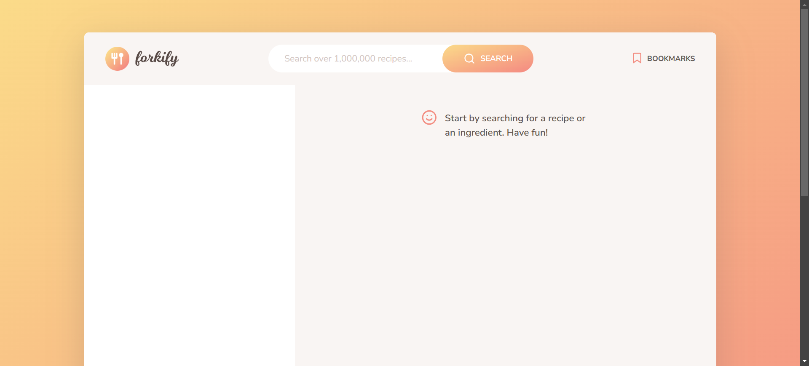
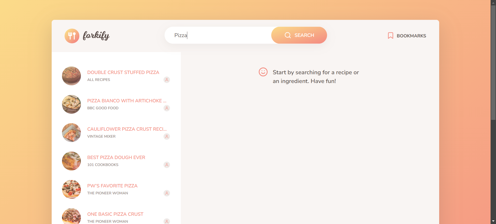
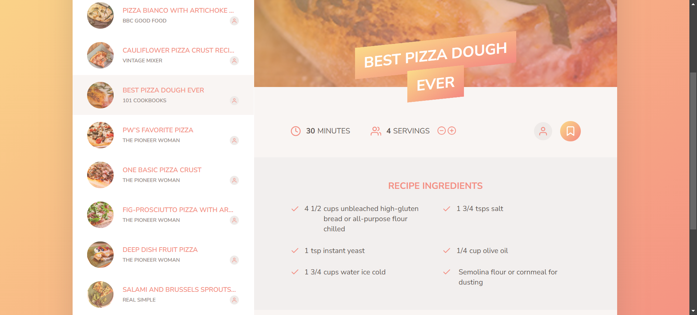
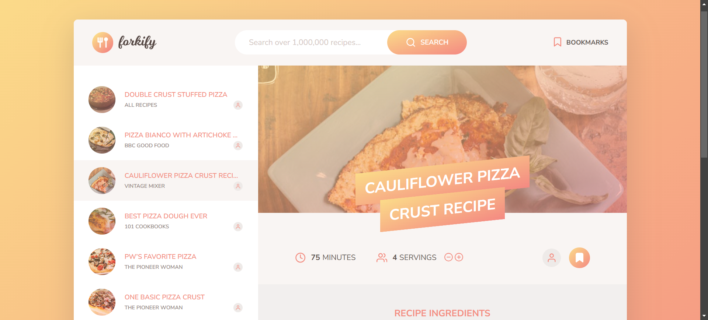
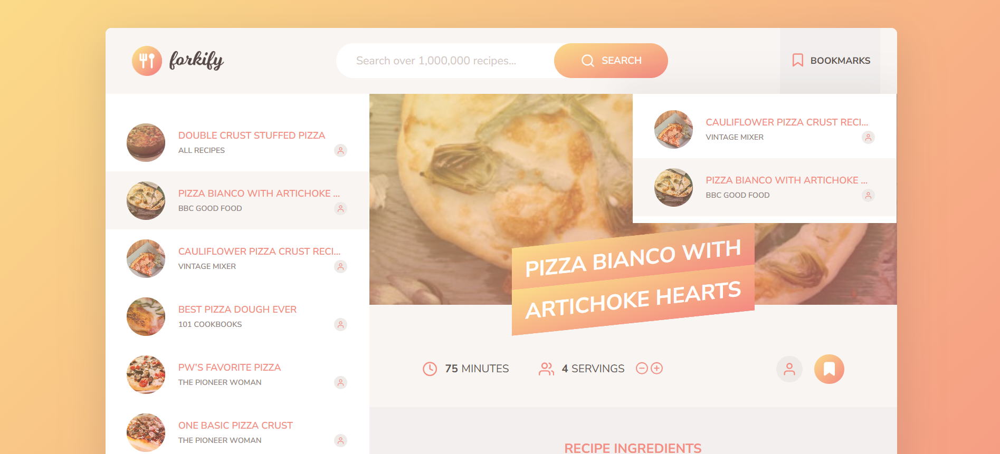
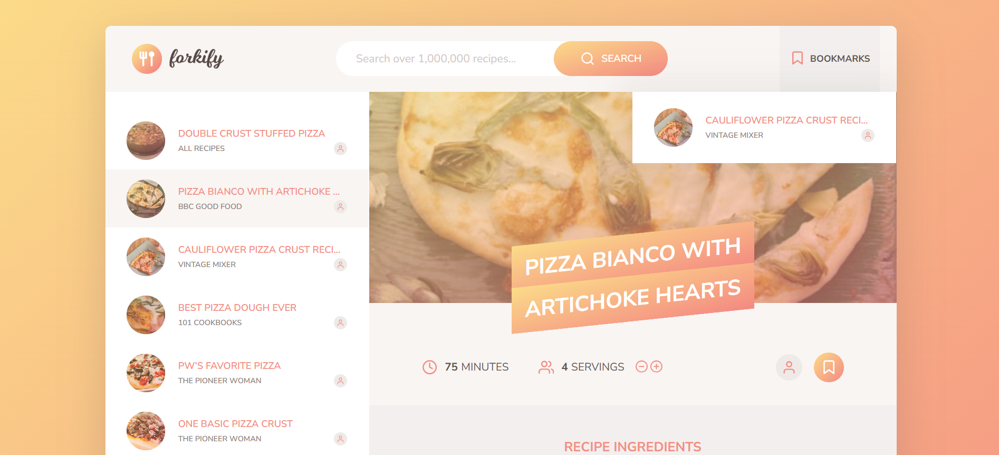

# Forkify 🍽️

Forkify is a JavaScript-based web application that allows users to search for recipes,
view detailed cooking instructions, adjust serving sizes, and bookmark their favorite
recipes. Built using modern JavaScript, it fetches data from the **Forkify API** and
provides a seamless, interactive experience.

## 🚀 Features

-   🔍 **Search Recipes** – Find thousands of recipes using the Forkify API.
-   📖 **View Recipe Details** – Get ingredients, cooking instructions, and images.
-   🔢 **Adjust Servings** – Dynamically update ingredient quantities.
-   ⭐ **Bookmark Favorite Recipes** – Save and access your favorite recipes anytime.
-   ⚡ **Fast & Responsive UI** – Built with modern JavaScript (ES6+).

## 🛠️ Technologies Used

-   **JavaScript (ES6+)**
-   **HTML5 & CSS3**
-   **Forkify API** (for fetching recipes)
-   **Parcel Bundler** (for project building)

## 📦 Installation & Setup

1. **Clone the repository:**

    ```sh
    git clone https://github.com/your-username/forkify.git
    cd forkify
    ```

2. **Install dependencies:**

    ```sh
    npm install
    ```

3. **Run the project locally:**

    ```sh
    npm start
    ```

4. **Build for production:**
    ```sh
    npm run build
    ```

## 📷 Screenshots

### 🏠 Dashboard


The main interface of Forkify, displaying the latest recipes and navigation options.

### 🔍 Search


Users can search for recipes by ingredient or dish name, with results displayed dynamically.

### 📖 Recipe Details


Detailed view of a selected recipe, including ingredients, cooking time, and serving adjustments.

### 🔢 Adjusting Ingredient Quantities

| Before Adjustment                      | After Adjustment                     |
| -------------------------------------- | ------------------------------------ |
|  |  |

When users change the serving size, the ingredient quantities update dynamically.

### ⭐ Bookmarking Recipes

#### **1️⃣ Adding a Recipe to Bookmarks**


Click the **bookmark icon** on a recipe to save it for later.

#### **2️⃣ Viewing Saved Bookmarks**


All saved recipes appear in the **Bookmarks Panel**, accessible anytime.

#### **3️⃣ Removing a Bookmark**


Click the **bookmark icon again** to remove a recipe from bookmarks.

## 🤝 Contributing

Feel free to fork this repository and make improvements! If you find any issues or have
suggestions, open an issue or submit a pull request. 🚀

---

💡 Made with ❤️ by **[Himanshu](https://github.com/Himanshu-Sorathiya)**
